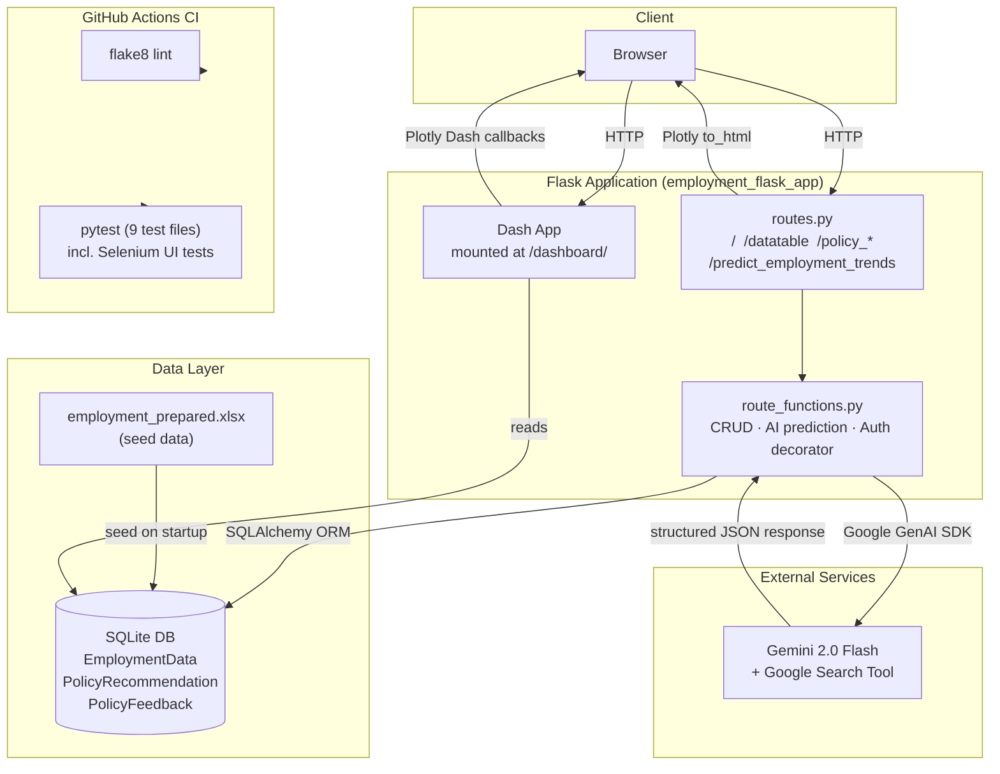
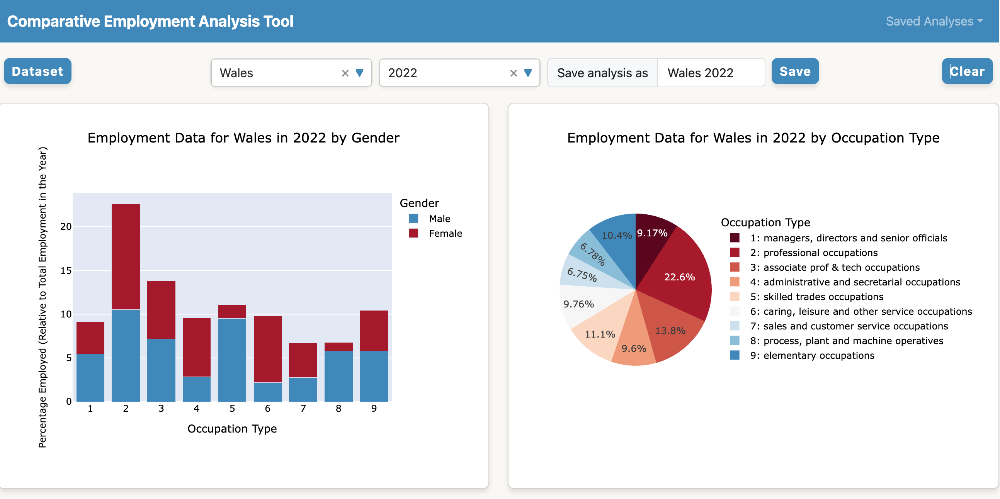
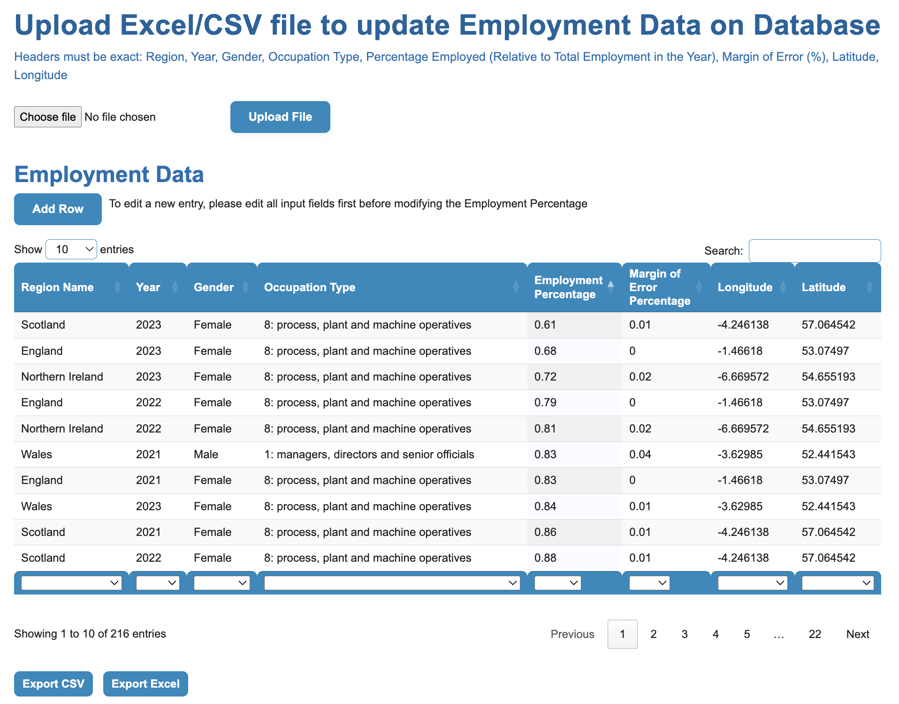

# Employment Analytics App


> **Live demo:** [employment-analytics-app.onrender.com](https://employment-analytics-app.onrender.com)

---

## What This Project Does

A full-stack data analytics platform for exploring, managing, and forecasting UK regional employment trends — built as a production-grade Flask application with an embedded Dash dashboard and AI-powered prediction.

**Core capabilities:**

- **Interactive data table** — full CRUD on employment records (add, edit, delete, bulk import/export as CSV or XLSX) backed by a relational database
- **Dash analytics dashboard** — embedded at `/dashboard/` using Plotly Dash inside the Flask application context; filters by region, year, gender, and occupation type
- **AI-powered trend forecasting** — calls Gemini 2.0 Flash with Google Search grounding to predict employment percentages N years forward, with error-aware forecasting and structured JSON output parsing
- **Policy workflow** — password-protected routes for submitting policy recommendations and collecting rated feedback, with a one-to-many relational model
- **CI pipeline** — GitHub Actions runs flake8 linting and a 9-file pytest suite (including Selenium UI tests) on every push

---

## Architecture



---

## Key Engineering Highlights

| Area | Detail |
|---|---|
| **Dash-in-Flask integration** | Dash is initialised inside the Flask app context (`init_dash_app`) and mounted at a sub-path, sharing the SQLAlchemy engine — a non-trivial integration that avoids running two separate servers |
| **AI forecasting pipeline** | Gemini 2.0 Flash is prompted with structured historical data and instructed to return a JSON array; the response is parsed with regex + `json.loads`, converted to a DataFrame, and rendered as an interactive Plotly bar chart |
| **REST-style CRUD API** | The datatable exposes `POST /datatable/add`, `PATCH /datatable/edit`, and `POST /datatable/delete` endpoints consumed by vanilla JS — no frontend framework dependency |
| **Decorator-based auth** | `@password_protected` is a reusable Flask route decorator using `functools.wraps` and `session` storage, applied to policy routes without touching route logic |
| **Import / export** | Users can upload `.xlsx` or `.csv` files to bulk-replace the dataset; export streams the full table via `BytesIO` without writing to disk |
| **ORM constraint design** | `UniqueConstraint` on composite keys prevents duplicate employment records at the database level, with rollback handling surfaced as flash messages |
| **Test coverage** | 9 pytest files covering home page rendering, full CRUD paths, import/export, AI prediction, and policy workflows; Selenium tests cover browser-level interactions |
| **CI on GitHub Actions** | flake8 (syntax errors + complexity checks) and pytest run automatically on every push and pull request |

---

## Screenshots
>
> 1. **Dashboard (`/dashboard/`)** — show the Dash layout with the interactive Plotly charts populated with real data, filters active (e.g. filtered by one region and occupation type). This is the most visually impressive view.
>
> 2. **Data Table (`/datatable`)** — show the table with data loaded, the import/export buttons visible, and ideally the inline edit or add-row modal open. Demonstrates the CRUD interface.
>
> 3. **Trend Prediction (`/predict_employment_trends`)** — show the form submitted with results: the Gemini-generated markdown analysis alongside the stacked bar chart. Demonstrates the AI integration end-to-end.




---

## Tech Stack

| Layer | Technology |
|---|---|
| Web framework | Flask 3, Blueprints |
| Dashboard | Plotly Dash (embedded in Flask) |
| ORM / DB | SQLAlchemy 2, SQLite |
| AI | Google Gemini 2.0 Flash via `google-genai` SDK |
| Data processing | pandas, openpyxl |
| Visualisation | Plotly Express |
| Forms | Flask-WTF |
| Testing | pytest, Selenium |
| CI | GitHub Actions (flake8 + pytest) |
| Deployment | Render |

---

## Project Structure

```text
.
├── src/
│   └── employment_flask_app/
│       ├── __init__.py            # App factory, SQLAlchemy init, Dash mount
│       ├── routes.py              # All URL routes and request handlers
│       ├── route_functions.py     # CRUD helpers, AI prediction, auth decorator
│       ├── models.py              # ORM models: EmploymentData, PolicyRecommendation, PolicyFeedback
│       ├── db.py                  # Database utilities
│       ├── forms/                 # Flask-WTF form definitions
│       ├── dash_app/              # Dash layout, callbacks, chart builders
│       │   ├── init_dash_app.py
│       │   ├── layout.py
│       │   ├── callbacks.py
│       │   └── charts.py
│       ├── data/
│       │   └── employment_prepared.xlsx   # Seed dataset
│       └── templates/             # Jinja2 HTML templates
├── tests/                         # 9-file pytest suite (unit + Selenium UI)
│   ├── conftest.py
│   ├── test_home_page.py
│   ├── test_datatable.py
│   ├── test_add_row.py
│   ├── test_edit_cell.py
│   ├── test_delete_row.py
│   ├── test_import_export.py
│   ├── test_predict_trend.py
│   ├── test_pol_feedback.py
│   └── test_rec_policy.py
├── .github/workflows/python-app.yml
├── pyproject.toml
└── requirements.txt
```

---

## Local Setup

```bash
# 1. Clone and enter the repo
git clone https://github.com/catalina-angelia/employment-analytics-app.git
cd employment-analytics-app

# 2. Create and activate a virtual environment
python -m venv .venv
source .venv/bin/activate   # Windows: .venv\Scripts\activate

# 3. Install dependencies
pip install -e .
pip install -r requirements.txt

# 4. Set environment variables
export SECRET_KEY=your-secret-key
export GENAI_API_KEY=your-google-genai-key   # Required for AI prediction

# 5. Run the app
flask --app employment_flask_app run --debug
```

Visit [http://127.0.0.1:5000](http://127.0.0.1:5000). The dashboard is at `/dashboard/`.

---

## Running Tests

```bash
pytest
```

The suite covers CRUD operations, home page rendering, file import/export, AI trend prediction, and policy management — including browser-level Selenium tests.

---

## Deployment

The app is deployed on **Render** at [employment-analytics-app.onrender.com](https://employment-analytics-app.onrender.com).

> **Note:** Render free-tier instances spin down after inactivity. If the page takes ~30 seconds to load on first visit, it is waking up — subsequent requests are fast.

---

## Data Attribution

Employment data sourced from the [Annual Population Survey (APS)](https://www.ons.gov.uk/employmentandlabourmarket/peopleinwork/employmentandemployeetypes/methodologies/annualpopulationsurveyapsqmi) published by the UK Office for National Statistics (ONS), licensed under the [Open Government Licence v3.0](https://www.nationalarchives.gov.uk/doc/open-government-licence/version/3/).
